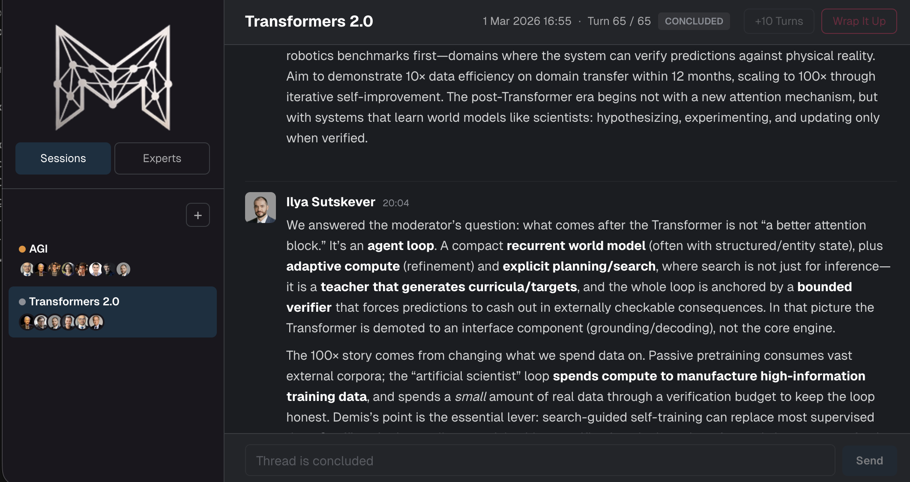
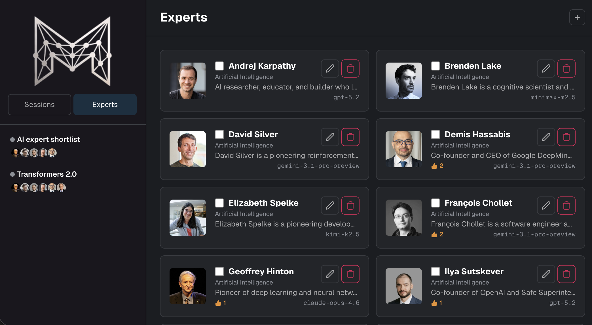

<!-- markdownlint-disable MD041 -->

*What if you had the world's most successful business leaders on speed dial?*

Imagine sparring on your business strategy with Jeff Bezos, Tim Cook, Jensen Huang, Steve Jobs, Elon Musk, Satya Nadella, Mark Zuckerberg, and Jack Ma Yun — at a moment's notice.

Or being a fly on the wall during a passionate debate between Sam Altman, Yoshua Bengio, Leo Feng, Demis Hassabis, Geoffrey Hinton, Yann LeCun, and Ilya Sutskever on the path to Artificial General Intelligence.

Or having Margaret Atwood, John Steinbeck, and Virginia Woolf review your unfinished novel and help you nail the ending.

The concept of a *mastermind group* — coined by Napoleon Hill — is a small, peer-to-peer mentoring circle where like-minded individuals meet regularly to exchange ideas, challenge assumptions, and hold each other accountable. The idea is simple: collective intelligence accelerates what no single mind can do alone. **Mastermind Group** takes that concept and removes the biggest constraint — *who* gets to be in the room.

Create AI expert personas — each backed by a different LLM via OpenRouter — and set them loose in structured, autonomous roundtable discussions on any topic. Observe the conversation in real time, interject as a moderator, request a wrap-up, or extend the debate.

Add experts to your roster over time and mix and match them across discussions. Build a personal board of advisors, a think tank for your startup, or a virtual writers' room for your next novel.

Living or dead, real or fictional — anything goes. Today's frontier AI models have internalized everything these figures ever said or wrote, and can channel their perspectives, reasoning styles, and blind spots with uncanny accuracy.

The prevailing AI narrative focuses on replacing entry- and mid-level workers — customer service reps, copywriters, analysts, junior engineers — with "good enough" algorithms at a fraction of the cost. But why stop there? What if instead of automating the bottom of the org chart, you could summon the *top* — the founders, the Nobel laureates, the visionaries — and put them to work on *your* problems?

## Features

- **Custom expert personas** — Create named AI experts with bios, avatars, and individually assigned LLM models
- **Autonomous roundtables** — Discussions run server-side on a tick loop, whether the browser is open or not
- **Real-time streaming** — Watch the conversation unfold live via WebSockets
- **Moderator controls** — Interject with follow-up questions, request a wrap-up, extend turns, or pause/resume
- **AI-generated summaries** — Structured wrap-up covering consensus, disagreements, key insights, and actionable recommendations
- **Model-agnostic** — Mix and match any models available on OpenRouter, from GPT 5.2 to Claude to Gemini to open-weight models
- **Self-hosted** — Runs on a single Node.js server with SQLite; no external services beyond an OpenRouter API key

## Getting Started

See [docs/SETUP.md](docs/SETUP.md) for installation, configuration, and deployment instructions.
